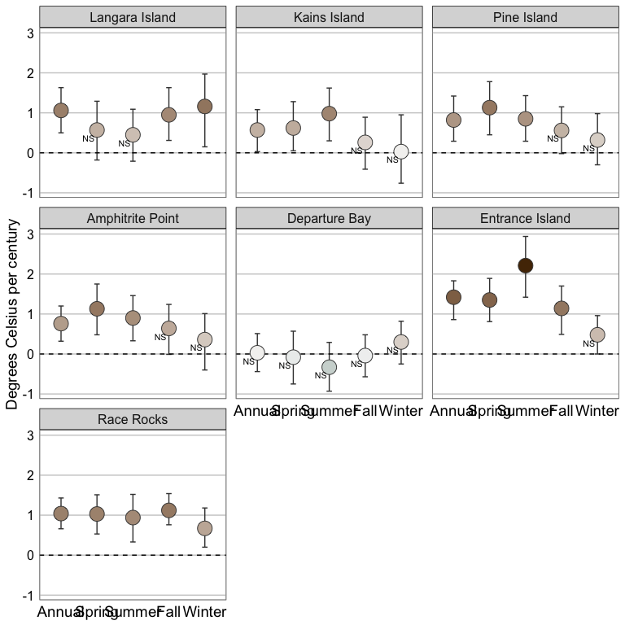
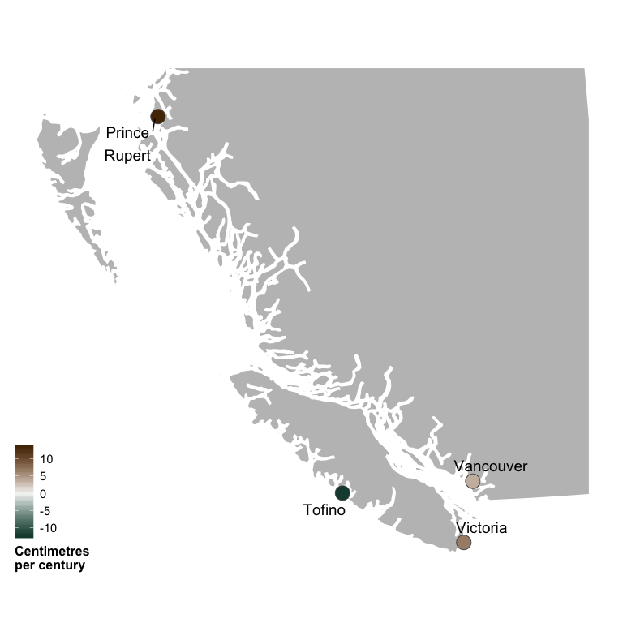
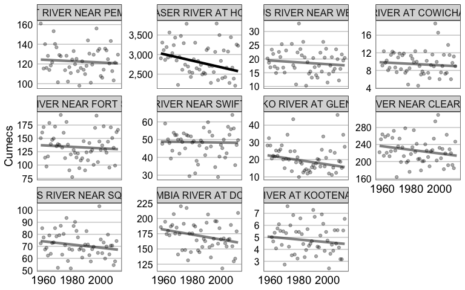

<!-- README.md is generated from README.Rmd. Please edit that file -->
[](https://github.com/BCDevExchange/docs/blob/master/discussion/projectstates.md) [](https://travis-ci.org/bcgov/cccharts)

cccharts
========

Introduction
------------

`cccharts` is an R package to plot climate change indicator data for British Columbia.

Utilisation
-----------

``` r
library(cccharts)
#> Loading required package: ggplot2
plot_estimates(data = cccharts::sea_surface_temperature_station, x = "Season", facet = "Station")
#> Warning: 1 data points have inconsistent significance and limits
```



``` r
map_estimates(data = cccharts::sea_level_station, station = TRUE, bounds = c(0.1,0.7,0,0.55))
```



``` r
plot_fit(data = dplyr::filter(cccharts::flow_station_timing, Term == "Medium"), observed = cccharts::flow_station_timing_observed, facet = "Station")
```



To generate the plot files (creates a folder in the working directory called `cccharts`).

    library(cccharts)
    demo("cccharts", ask = FALSE)

Installation
------------

To install the latest version from GitHub

    # install.packages("devtools")
    devtools::install_github("bcgov/cccharts")

Contribution
------------

Please report any [issues](https://github.com/bcgov/cccharts/issues).

[Pull requests](https://github.com/bcgov/cccharts/pulls) are always welcome.

If you would like to contribute, please see our [CONTRIBUTING](CONTRIBUTING.md) guidelines.

Please note that this project is released with a [Contributor Code of Conduct](CODE_OF_CONDUCT.md). By participating in this project you agree to abide by its terms.

License
-------

    Copyright 2016 Province of British Columbia

    Licensed under the Apache License, Version 2.0 (the "License");
    you may not use this file except in compliance with the License.
    You may obtain a copy of the License at 

       http://www.apache.org/licenses/LICENSE-2.0

    Unless required by applicable law or agreed to in writing, software
    distributed under the License is distributed on an "AS IS" BASIS,
    WITHOUT WARRANTIES OR CONDITIONS OF ANY KIND, either express or implied.
    See the License for the specific language governing permissions and
    limitations under the License.

Maintenance
-----------

This repository is maintained by [Environmental Reporting BC](http://www2.gov.bc.ca/gov/content?id=FF80E0B985F245CEA62808414D78C41B). Click [here](https://github.com/bcgov/EnvReportBC-RepoList) for a complete list of our repositories on GitHub.
